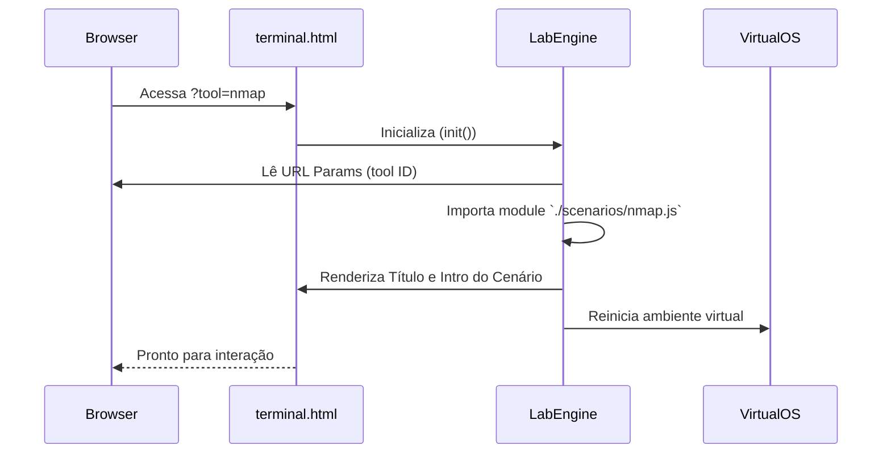

# Arquitetura do Sistema

O **Kali Linux Labs Beginner** adota uma arquitetura **SPA (Single Page Application)** modificada, focada em performance e independência de servidor (Serverless/Static). Todo o processamento lógico ocorre no navegador do usuário.

## Diagrama de Componentes

O sistema é composto por três camadas principais:

1. **View Layer (Interface):** HTML5 + Tailwind CSS + Xterm.js (Renderização do Terminal).
2. **Controller Layer (Engine):** `LabEngine.js` (Gerenciador de Estado e Missões).
3. **Model/Simulation Layer (Virtualization):** `VirtualOS.js` (Simulador de Filesystem e Kernel) e Scenarios (Módulos de Missão).

## Fluxo de Execução

Quando um usuário digita um comando no terminal, o fluxo segue o seguinte caminho:

```mermaid
sequenceDiagram
    actor User as Usuário
    participant UI as Interface (Xterm.js)
    participant Engine as LabEngine (Controller)
    participant VOS as VirtualOS (Simulador)
    participant Scenario as Cenário Ativo

    User->>UI: Digita comando (ex: "nmap -sS target")
    UI->>Engine: Captura evento onData/Enter
    Engine->>Engine: Valida estado atual (Pausado/Ativo)
    
    rect rgb(20, 20, 20)
        note right of Engine: Processamento do Comando
        Engine->>VOS: Envia comando para processamento
        VOS->>VOS: Parse do comando (args, flags)
        
        alt Comando do Sistema (ls, cd, cat)
            VOS-->>Engine: Retorna saída do sistema de arquivos
        else Comando de Ferramenta (nmap, sqlmap)
            VOS->>Scenario: Verifica se cenário intercepta comando
            Scenario-->>VOS: Retorna saída simulada ou Erro
            VOS-->>Engine: Retorna saída da ferramenta
        end
    end

    Engine->>UI: Escreve saída no Terminal
    
    rect rgb(0, 40, 0)
        note right of Engine: Validação de Progresso
        Engine->>Scenario: stepVerifier(comando)
        alt Comando Correto
            Scenario-->>Engine: true
            Engine->>UI: Exibe Feedback de Sucesso
            Engine->>Engine: Avança para próximo passo
            Engine->>UI: Atualiza painel de instruções
        else Comando Incorreto
            Scenario-->>Engine: false
            Engine->>UI: (Opcional) Exibe dica
        end
    end
```

## Estrutura de Diretórios e Módulos

A arquitetura de arquivos reflete a separação de responsabilidades:

- `pages/`: Contém as "Views" (terminal.html, wiki.html).
- `assets/js/`:
  - `lab-engine.js`: O orquestrador central. Carrega cenários dinamicamente via ES6 `import`.
  - `virtual-os.js`: Mantém um objeto JSON representando a árvore de diretórios e o estado do "usuário" (root/guest).
  - `scenarios/`: Cada arquivo (`nmap.js`, `sqlmap.js`) é um módulo autônomo que exporta um objeto de configuração com passos, validações e saídas esperadas.

## Carregamento Dinâmico de Cenários

Para manter a aplicação leve, os cenários são carregados sob demanda baseados na URL Query String (`?tool=nome_ferramenta`).

