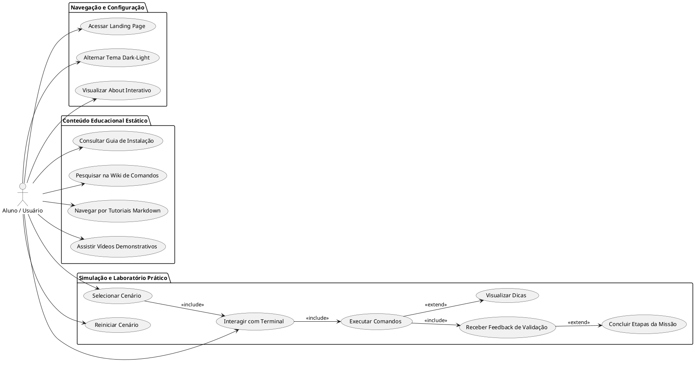

# Diagrama de Casos de Uso

Este documento apresenta o **Diagrama de Casos de Uso** do projeto Kali Linux Labs Beginner, ilustrando as principais interações do usuário com o sistema, divididas entre navegação, aprendizado teórico e a engine de simulação prática.

## Descrição dos Atores e Casos de Uso

### Atores

- **Aluno / Usuário**: O indivíduo que acessa a plataforma para aprender sobre Kali Linux e segurança ofensiva. Não requer login ou autenticação (sistema stateless no frontend).

### Pacotes de Funcionalidades

#### 1. Navegação e Configuração

Funcionalidades transversais disponíveis em todas as páginas.

- **Alternar Tema**: O usuário pode escolher entre modo claro e escuro, persistindo a escolha localmente.
- **Visualizar 'About'**: Acesso a uma página de perfil estilizada como terminal.

#### 2. Conteúdo Educacional Estático

Recursos passivos de aprendizado.

- **Wiki de Comandos**: Busca rápida por sintaxe de ferramentas.
- **Guias e Vídeos**: Consumo de material teórico para apoio aos laboratórios.

#### 3. Simulação e Laboratório Prático

O núcleo da aplicação (Engine).

- **Interagir com Terminal**: O usuário digita em uma interface que emula um shell Linux (zsh/bash).
- **Executar Comandos**: O sistema interpreta inputs específicos (ex: `nmap -sS target`) usando o `virtual-os.js`.
- **Receber Feedback**: O `lab-engine.js` verifica se o comando corresponde ao passo atual da missão e retorna sucesso ou erro simulado.
