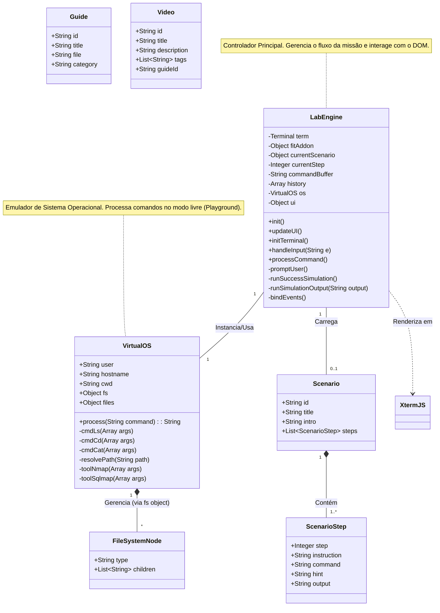

# Diagrama de Classes

O diagrama abaixo apresenta a estrutura orientada a objetos (e estruturas de dados) utilizada no frontend da aplicação **Kali Linux Labs Beginner**.

## Dicionário de Classes

### 1. Classes Principais

- **`LabEngine`**: A classe controladora central (`assets/js/lab-engine.js`). É responsável por inicializar o terminal, carregar o cenário selecionado via URL, capturar o input do usuário e decidir se deve validar contra o cenário guiado ou passar para o `VirtualOS`.
- **`VirtualOS`**: A classe de emulação (`assets/js/virtual-os.js`). Mantém o estado do sistema virtual (diretório atual, sistema de arquivos em memória) e contém a lógica para "falsificar" os comandos Linux (`ls`, `cd`, `cat`) e ferramentas de segurança (`nmap`, `sqlmap`) quando o usuário está no modo livre.

### 2. Estruturas de Dados

- **`Scenario`**: Define o contrato dos objetos exportados em `assets/js/scenarios/*.js`. Representa uma missão completa.
- **`ScenarioStep`**: Representa um passo individual de uma missão, contendo a instrução para o usuário, o comando exato esperado e a saída de terminal simulada.
- **`FileSystemNode`**: Estrutura JSON interna do `VirtualOS` que representa diretórios e arquivos.
- **`Guide` & `Video`**: Objetos de dados planos definidos em `guides.js` e `videos.js` para popular as páginas de documentação e mídia.
