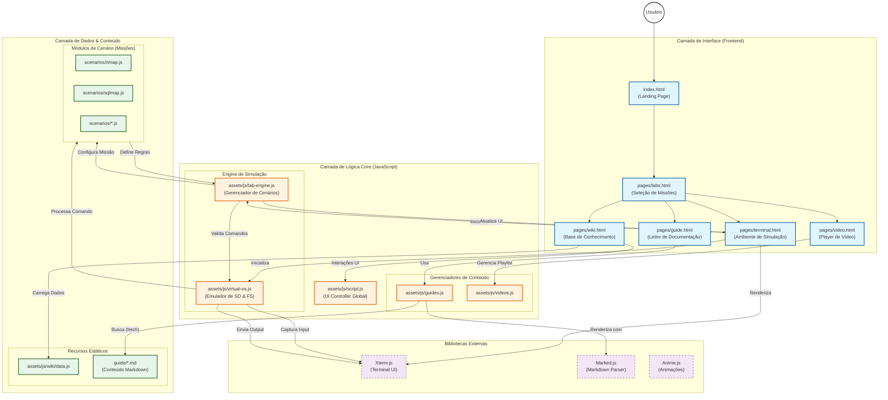

# Diagrama Conceitual da Arquitetura

Este documento detalha a arquitetura conceitual e o fluxo de dados do projeto **Kali Linux Labs Beginner**. O diagrama abaixo ilustra como as camadas de Interface, Lógica Core e Dados interagem para prover a experiência de simulação.

## Descrição dos Componentes

### 1. Camada de Interface

Responsável pela apresentação e layouts do sistema.

- **index.html**: Ponto de entrada.
- **pages/terminal.html**: O coração do projeto. Contém o container onde o `Xterm.js` é renderizado.

### 2. Camada de Lógica Core

- **VirtualOS (`virtual-os.js`)**: Simula um sistema de arquivos Linux e processa comandos básicos (`ls`, `cd`, `cat`, etc.) inteiramente no navegador, sem backend real.
- **LabEngine (`lab-engine.js`)**: Atua como o "Game Master". Ele carrega o cenário escolhido, monitora o progresso do usuário passo-a-passo e fornece feedback/dicas.
- **Content Managers**: Scripts especializados para carregar e formatar conteúdo dinâmico (Markdown, Vídeos).

### 3. Camada de Dados

- **Cenários (`scenarios/*.js`)**: Cada arquivo exporta um objeto contendo os passos da missão, comandos esperados e validações específicas (regex ou strings exatas).
- **Guias (`guide/*.md`)**: Arquivos de texto puro contendo a teoria e tutoriais, renderizados dinamicamente nas páginas.
