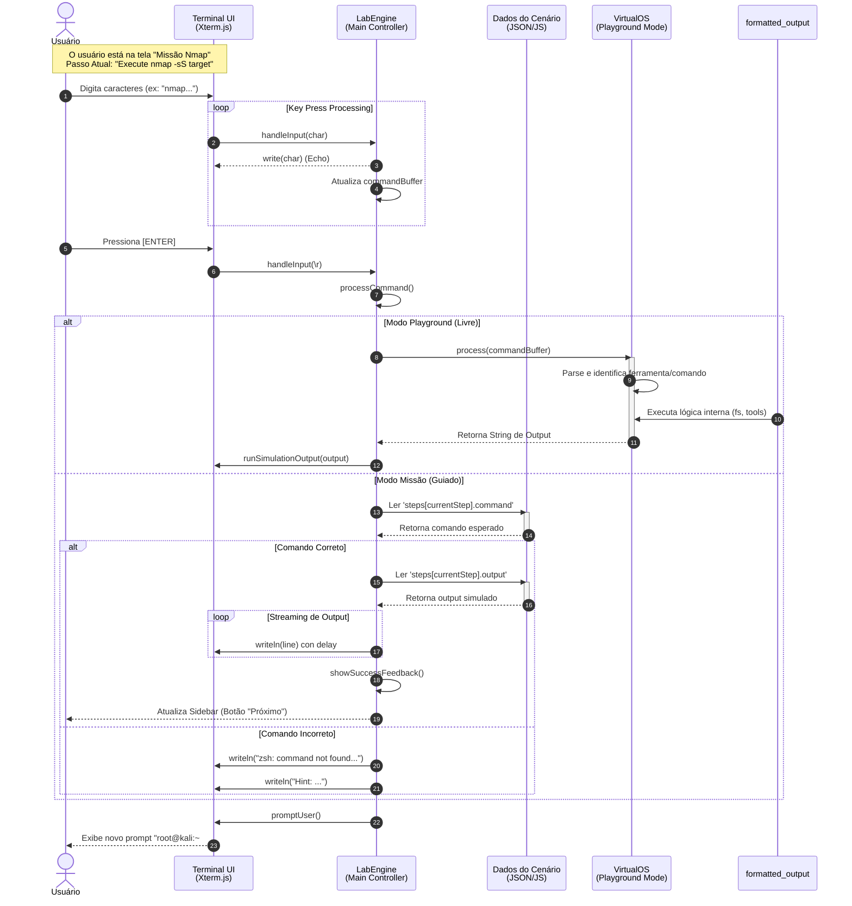

# Diagrama de Sequência

Este documento detalha o fluxo de execução para a validação de comandos dentro do Laboratório Virtual, ilustrando a interação entre o Usuário, o Terminal UI (Xterm.js), a Engine de Controle e os Dados do Cenário.

## Fluxo: Execução de Comando em Missão Guiada

O diagrama abaixo descreve o processo passo-a-passo desde que o usuário digita um comando até receber o feedback de sucesso ou erro.

## Descrição dos Participantes

1. **Terminal UI (Xterm.js)**: Interface visual bruta. Captura eventos de teclado e renderiza texto, mas não possui "inteligência" sobre o que está sendo digitado.
2. **LabEngine**: O cérebro da aplicação. Mantém o estado da aplicação (`buffer`, `currentStep`, `history`). Decide se deve validar contra um roteiro (Missão) ou delegar para execução livre (Playground).
3. **VirtualOS**: Usado principalmente no modo Playground, atua como um sistema operacional simulado, analisando inputs e retornando respostas falsas, mas realistas.
4. **Dados do Cenário**: Arquivos estáticos `.js` que contêm a "gabarito" da missão (comando esperado) e o resultado que deve ser exibido (output esperado).
