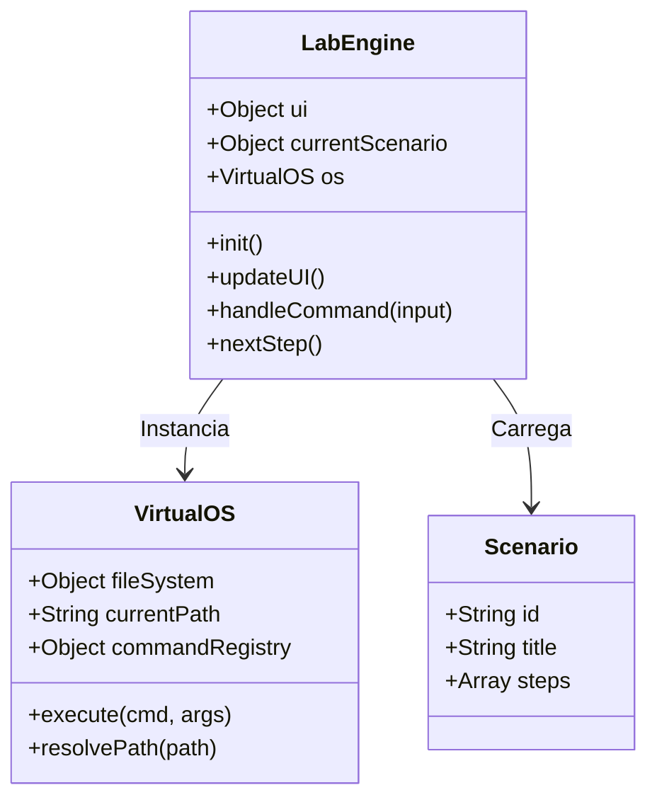

# Backend Lógico (Client-Side Simulation)

Embora o projeto não possua um backend de servidor tradicional (Node.js/Python rodando lógica de negócios), ele possui uma complexa camada lógica em JavaScript que atua como um "Backend Virtual".

## Core: LabEngine (`assets/js/lab-engine.js`)

A classe `LabEngine` é o cérebro da aplicação. Suas principais responsabilidades são:

1. **Gerenciamento de Ciclo de Vida:** Inicializa o terminal, carrega dependências e "limpa" o ambiente ao trocar de cenário.
2. **Bridge UI-Lógica:** Conecta os eventos do Xterm.js (input teclado) com as funções de processamento do VirtualOS.
3. **Sistema de Validação:** Compara os comandos digitados pelo usuário com RegEx ou strings definidas nos arquivos de cenário para determinar se um objetivo foi cumprido.

### Snippet de Validação (Lógica Simplificada)

```javascript
// Exemplo de como o Engine valida um passo
checkStep(input) {
    const currentStepObj = this.scenario.steps[this.currentStep];
    
    // Se o passo define uma função de verificação customizada
    if (currentStepObj.verify && typeof currentStepObj.verify === 'function') {
        return currentStepObj.verify(input);
    }
    
    // Validação padrão por expressão regular
    if (currentStepObj.validacao) {
        return new RegExp(currentStepObj.validacao).test(input);
    }
    
    return false;
}
```

## Simulação de OS: VirtualOS (`assets/js/virtual-os.js`)

Para aumentar a imersão, o sistema não apenas aceita comandos pré-definidos, mas simula um ambiente Linux funcional.

### Funcionalidades do VirtualOS

* **File System Virtual:** Um objeto JSON recursivo representa diretórios e arquivos. Comandos como `ls`, `cd`, `mkdir` e `cat` realmente interagem com essa estrutura de dados, permitindo navegação persistente durante a sessão.
* **Command Parsing:** Analisa strings brutas (ex: `nmap -sV 192.168.1.1`) e as quebra em comando base (`nmap`) e argumentos (`['-sV', '192.168.1.1']`), suportando flags simples.
* **Mock Network:** Alguns comandos de rede simulam latência e resolução de DNS fictícia para criar realismo.

## Definição de Cenários (`assets/js/scenarios/*.js`)

Cada laboratório é definido por um objeto JSON exportado, que contém a narrativa e a lógica de execução.

### Estrutura de um Objeto de Cenário

| Propriedade | Tipo | Descrição |
| :--- | :--- | :--- |
| `id` | String | Identificador único (ex: 'sqlmap'). |
| `title` | String | Título exibido na UI. |
| `intro` | String (HTML) | Texto de briefing inicial da missão. |
| `steps` | Array | Lista ordenada de passos da missão. |

### Estrutura de um Passo (`step`)

```javascript
{
    instruction: "Use o nmap para escanear a rede alvo.",
    command: "nmap 192.168.1.10", // Comando sugerido (placeholder visual)
    hint: "Lembre-se que o IP alvo é 192.168.1.10", // Dica opcional
    
    // Lógica de Execução Simulada
    output: "Starting Nmap 7.92...\nHost is up (0.002s latency)...\nPORT STATE SERVICE\n80/tcp open http",
    
    // Lógica de Validação
    validacao: "nmap\\s+192\\.168\\.1\\.10" // Regex para validar o input do usuário
}
```

## Diagrama de Classes Simplificado


